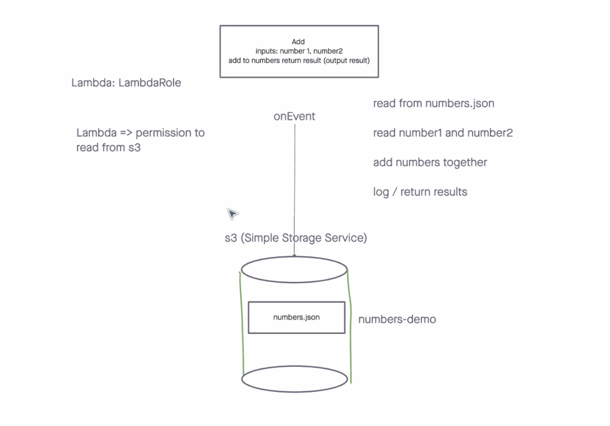
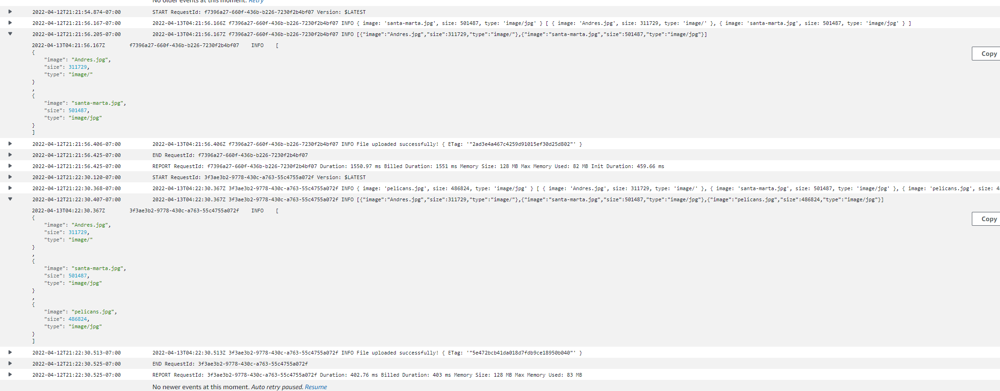

# Lambda-S3

## How To Use The Lambda

Add an image to the s3 bucket and that triggers the function

## Issues Encountered

Still can't really figure out how to upload the images.json file back to the s3 bucket
The rest of the code is working as intended

## Images File

